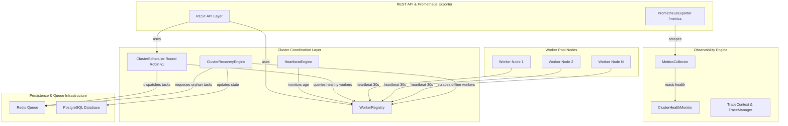

# Sprint F4 — Distributed Cluster Architecture & Observability

## Overview
Sprint F4 introduces horizontal scaling, cluster coordination, worker registry management, heartbeat health tracking, deterministic round-robin scheduling, cluster recovery, and Prometheus observability metrics into KarsaSec.

---

## 1. System Architecture Diagram

---

## 2. Component Specifications

### Worker Registry (`karsasec/workers/worker_registry.py`)
- Manages node identity via SHA-256 token hashing (`auth_token_hash`).
- Detects worker impersonation and forged heartbeats.
- Logs `FORGED_WORKER_HEARTBEAT` audit events upon authorization failure.

### Heartbeat Engine (`karsasec/workers/heartbeat.py`)
- Periodic 30-second heartbeat interval expectation.
- Thresholds:
  - $age \le 45\text{s}$: `ONLINE`
  - $45\text{s} < age \le 90\text{s}$: `DEGRADED`
  - $age > 90\text{s}$: `OFFLINE`

### Cluster Scheduler (`karsasec/workers/scheduler.py`)
- Round Robin v1 scheduling algorithm:
  $$\text{index} = \text{task\_counter} \pmod{|\text{active\_workers}|}$$
- Complexity: Time $O(1)$, Space $O(1)$.
- Guarantees deterministic worker selection.

### Distributed Recovery (`karsasec/workers/cluster_recovery.py`)
- Scans `RUNNING` tasks assigned to `OFFLINE` workers.
- Requeues tasks safely (`RUNNING` $\rightarrow$ `FAILED_RETRYABLE` $\rightarrow$ `QUEUED`).
- Enforces Terminal State Protection Invariant: `COMPLETED`, `FAILED`, and `CANCELLED` tasks are never modified.

### Observability & Prometheus Exporter (`karsasec/observability/`)
- `PrometheusExporter` renders standard `/metrics` exposition text.
- Exposes:
  - `karsasec_queue_depth`
  - `karsasec_active_workers`
  - `karsasec_running_tasks`
  - `karsasec_task_completed_total`
  - `karsasec_task_failed_total`
  - `karsasec_task_retry_total`
  - `karsasec_task_recovery_total`
- Enforces R7-R9 Privacy Boundary: Zero source code, diffs, tokens, or credentials allowed.
