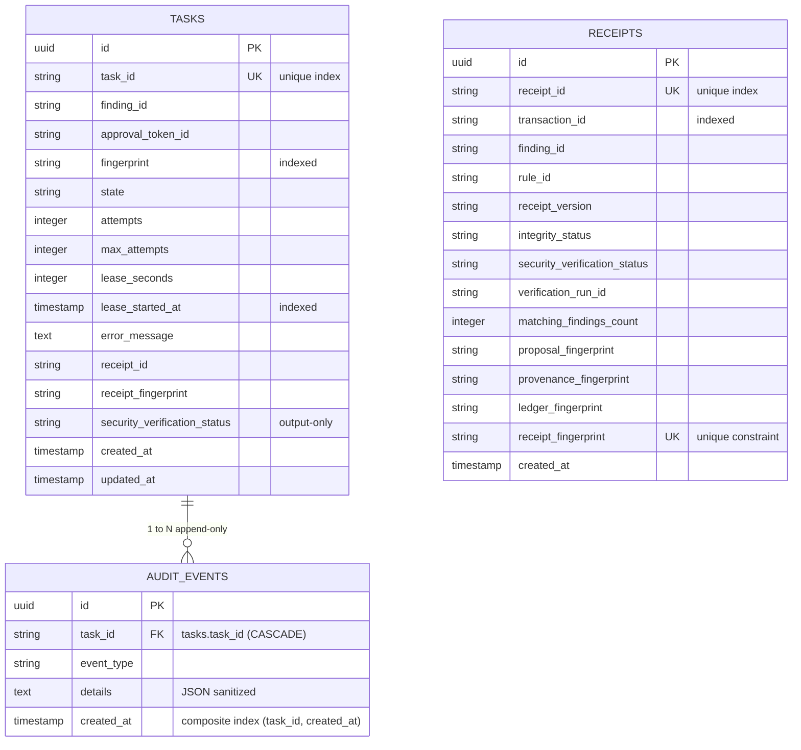

# Phase 1 — Repository Dependency Analysis

## Overview
This document presents the structural, dependency, ORM, and migration graph analysis for the `karsasec/persistence/` module introduced in Sprint F3.

---

## 1. Module File Map
```text
karsasec/persistence/
├── __init__.py                (Module metadata & invariants)
├── db.py                      (DatabaseEngine singleton & session factory)
├── models.py                  (SQLAlchemy 2.x Declarative Base & ORM Models)
├── task_repository.py         (PostgresTaskRepository implementation)
├── receipt_repository.py      (PostgresReceiptRepository implementation)
├── audit_repository.py        (PostgresAuditRepository implementation)
├── recovery.py                 (StartupRecoveryEngine implementation)
└── migrations/
    ├── env.py                 (Alembic environment configuration)
    ├── script.py.mako         (Alembic migration template)
    └── versions/
        └── 16e35b77308a_initial_schema.py  (Initial PostgreSQL DDL Migration)
```

---

## 2. Dependency Graph

```mermaid
graph TD
    subgraph Core Framework & Workers
        RemediationTask[karsasec.workers.task.RemediationTask]
        TaskRepositoryContract[karsasec.workers.repository.TaskRepository]
        TaskQueueContract[karsasec.workers.queue.TaskQueue]
    end

    subgraph Persistence Layer
        DB[karsasec.persistence.db]
        Models[karsasec.persistence.models]
        PostgresTaskRepo[karsasec.persistence.task_repository.PostgresTaskRepository]
        PostgresReceiptRepo[karsasec.persistence.receipt_repository.PostgresReceiptRepository]
        PostgresAuditRepo[karsasec.persistence.audit_repository.PostgresAuditRepository]
        RecoveryEngine[karsasec.persistence.recovery.StartupRecoveryEngine]
    end

    subgraph Migration Infrastructure
        AlembicEnv[karsasec.persistence.migrations.env]
        InitialSchema[migrations.versions.16e35b77308a_initial_schema]
    end

    DB -->|imports| Models
    PostgresTaskRepo -->|uses| DB
    PostgresTaskRepo -->|uses| Models
    PostgresTaskRepo -->|implements| TaskRepositoryContract
    PostgresTaskRepo -->|maps| RemediationTask

    PostgresReceiptRepo -->|uses| DB
    PostgresReceiptRepo -->|uses| Models

    PostgresAuditRepo -->|uses| DB
    PostgresAuditRepo -->|uses| Models

    RecoveryEngine -->|uses| PostgresTaskRepo
    RecoveryEngine -->|uses| TaskQueueContract
    RecoveryEngine -->|uses| PostgresAuditRepo

    AlembicEnv -->|imports| Models
    InitialSchema -->|reflects| Models
```



---

## 3. ORM Graph & Schema Constraints



---

## 4. Architectural Summary & Verification
1. **Isolation**: `models.py` does not import any AI engines, worker runtimes, routers, or static analysis tools.
2. **Coupling**: The persistence layer strictly implements abstract repository contracts from `karsasec.workers.repository`.
3. **Database Drivers**: Utilizes SQLAlchemy 2.x standard dialect configuration with PostgreSQL-native `UUID` types.
