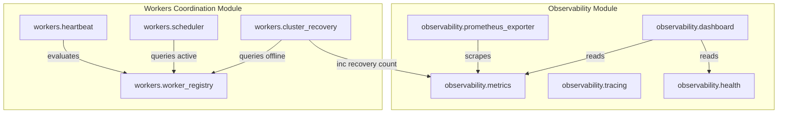

# Phase 1 — Sprint F4 Repository Dependency Analysis

## Overview
This document outlines the dependency graph, module layout, and structural relationships for `karsasec/observability/` and distributed worker coordination components in `karsasec/workers/`.

## File Structure Map
```text
karsasec/
├── observability/
│   ├── __init__.py
│   ├── metrics.py
│   ├── tracing.py
│   ├── health.py
│   ├── dashboard.py
│   └── prometheus_exporter.py
└── workers/
    ├── worker_registry.py
    ├── heartbeat.py
    ├── scheduler.py
    └── cluster_recovery.py
```

## Module Dependency Graph


