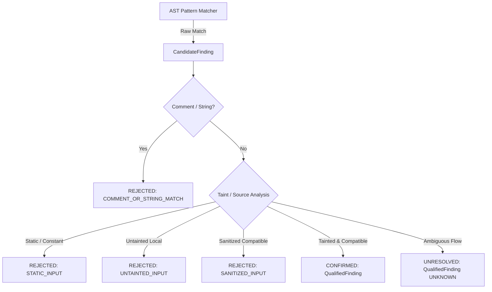

# False Positive (FP) Taxonomy Engine — Sprint E12-3

## Overview
Sprint E12-3 introduces a formal, audit-ready False Positive (FP) taxonomy engine in KarsaSec. Every raw candidate match produced by AST pattern matching must pass through the `SemanticFindingQualifier` state machine. Candidates that do not meet semantic criteria are elevated or explicitly rejected with a deterministic taxonomy reason.

---

## FP Taxonomy Classifications (`FPTaxonomyReason`)

| Taxonomy Reason | Enum Value | Description | Hardening Strategy |
| :--- | :--- | :--- | :--- |
| **Lexical Only Match** | `LEXICAL_ONLY` | Raw keyword match without required AST node context or structural position. | AST node verification (`ast_node_types` validation in qualifier). |
| **Comment or String Match** | `COMMENT_OR_STRING_MATCH` | Match occurs inside a code comment or static documentation block rather than an executable AST node. | Context line scanning & comment marker detection (`//`, `/*`, `#`, `*`). |
| **Untainted Input Source** | `UNTAINTED_INPUT` | Sink argument is fed by a known untainted local variable or static internal parameter. | Incremental Data-Flow & Taint Engine verification. |
| **Static Hardcoded Input** | `STATIC_INPUT` | Sink argument is a hardcoded literal or statically resolved constant (`ConstantResolver`). | `ConstantResolver` evaluation & static pattern matching. |
| **Sanitized Input Stream** | `SANITIZED_INPUT` | Taint path contains a sanitizer function compatible with the sink's vulnerability category. | `CompatibilityRegistry` sanitizer matrix check. |
| **Incompatible Sink Category** | `INCOMPATIBLE_SINK` | Candidate source/sanitizer is semantically incompatible with the sink requirement (e.g. `htmlspecialchars` for command execution). | `CompatibilityRegistry` source/sink matrix check. |
| **Unknown Taint Flow** | `UNKNOWN_FLOW` | Data-flow reachability is ambiguous or unbounded. Tracked as `UNRESOLVED` rather than dropped. | Retained with `UNKNOWN` confidence; never auto-suppressed as FP. |

---

## Qualification State Machine Pipeline

---

## Ground Truth Invariants
1. Ground truth manifests (`benchmarks/dvwa/manifest.yaml`) are immutable.
2. All candidate suppressions are logged with explicit `rejection_reason` for complete audit transparency.
3. E11 Recall gates (Command Injection ≥ 100%, Path Traversal = 100%, SQL Injection ≥ 71%, Overall Recall ≥ 65%) are strictly enforced.
